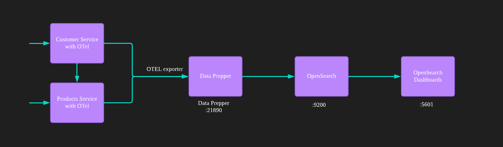
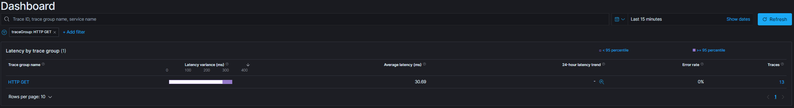
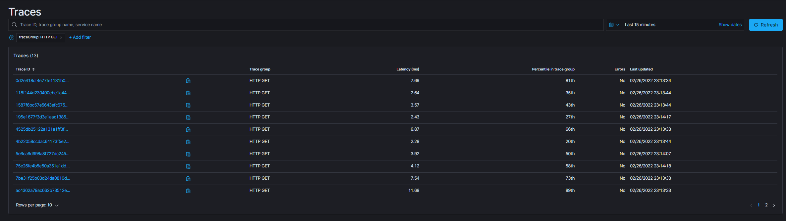

# Spring-Sleuth-Otel-OpenSearch
Sample Application with Spring Sleuth OpenTelemetry and OpenSearch as backend.

## Spring Sleuth OpenTelemetry + OTLP Exporter
This Branch has source for Spring sleuth opentelemetry instrumentation and otlp-exporter.








See the dependencies in maven (As of now the sleuth-otel is not GA, hence we need to add extra dependency repos.)

```xml
<dependencies>
  ...

        <!-- Sleuth with OpenTelemetry tracer implementation -->
        <dependency>
            <groupId>org.springframework.cloud</groupId>
            <artifactId>spring-cloud-starter-sleuth</artifactId>
            <exclusions>
                <exclusion>
                    <groupId>org.springframework.cloud</groupId>
                    <artifactId>spring-cloud-sleuth-brave</artifactId>
                </exclusion>
            </exclusions>
        </dependency>
        <!-- This dependency adds OTel support -->
        <dependency>
            <groupId>org.springframework.cloud</groupId>
            <artifactId>spring-cloud-sleuth-otel-autoconfigure</artifactId>
        </dependency>

        <dependency>
            <groupId>io.opentelemetry</groupId>
            <artifactId>opentelemetry-exporter-otlp-trace</artifactId>
        </dependency>

    ...
    </dependencies>
    <dependencyManagement>
        <dependencies>
        ...
            <dependency>
                <groupId>org.springframework.cloud</groupId>
                <artifactId>spring-cloud-sleuth-otel-dependencies</artifactId>
                <!-- Provide the version of the Spring Cloud Sleuth OpenTelemetry project -->
                <version>${spring-cloud-sleuth-otel.version}</version>
                <scope>import</scope>
                <type>pom</type>
            </dependency>
        </dependencies>
    </dependencyManagement>

        <!-- You 'll need those to add OTel support -->
    <repositories>
        <repository>
            <id>spring-snapshots</id>
            <url>https://repo.spring.io/snapshot</url>
            <snapshots><enabled>true</enabled></snapshots>
        </repository>
        <repository>
            <id>spring-milestones</id>
            <url>https://repo.spring.io/milestone</url>
        </repository>
    </repositories>
    <pluginRepositories>
        <pluginRepository>
            <id>spring-snapshots</id>
            <url>https://repo.spring.io/snapshot</url>
        </pluginRepository>
        <pluginRepository>
            <id>spring-milestones</id>
            <url>https://repo.spring.io/milestone</url>
        </pluginRepository>
    </pluginRepositories>
```

We do not need otel-collector now, instead from the application we directly send the traces to data-prepper.
